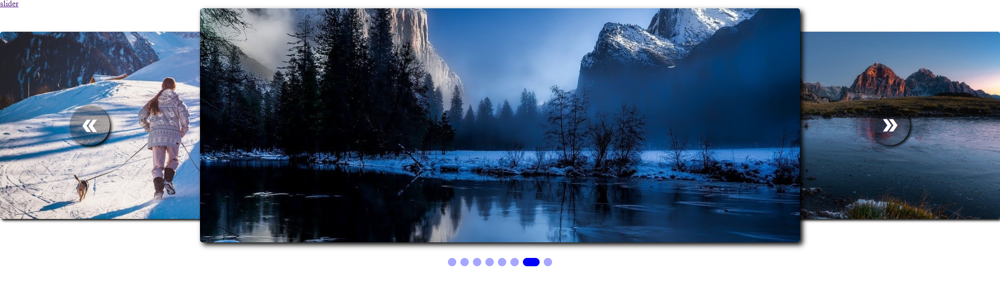

<br/>
<hr>

<br/>
<a href="https://lapis-image-slider.herokuapp.comr">Live demo</a>

<br/>
<hr>
<br/>

Run this command to start:
```
    npm start
```

<br/>
<hr>
<br/>

How to use:
```jsx
<App>
    <ImageSlider focus={1}>
        <Image src='link of image'>
            {/* your code(option) */}
        </Image>
        <Image>
            <div>
                {/* your code */}
            </div>
        </Image>
    </ImageSlider>
</App>
```

<br/>
<hr>
<br/>

Image component:
```jsx
<Image src='link_of_image'>
    {/*any child*/}
</Image>
```

<br/>
<hr>
<br/>

ImageSlider:

```jsx
{/*Image focus is the image being projected in the center*/}
<ImageSlider
    
    focus={1} {/*Number of image you want to focus*/}
    interval={2000}
    onFocusChange={
        callback(
            eventFocusChange: IImageSliderOnFocusChangeEventData
        )
    }
>
    {/*<Image>*/}
</ImageSlider>
```

```typescript
interface IImageSliderOnFocusChangeEventData{
    preventDefault: () => void,
    index:number, // number of image is focusing
}
```
<br/>
<hr>
<br/>

Style:
```scss
.image-slider {
    // 
    // The global width is a width of ImageSlider
    // The center Image has width 60% of ImageSlider
    // Left Image and right Image has width 40% of ImageSlider
    //
    --image-slider-width: 100%; // to change global width
    --image-slider-height: 500px; // to change global height
    --image-slider-nav-height: 50px;
    //
    --image-slider-image-height: calc(var(--image-slider-height) - var(--image-slider-nav-height));
    //
    display: block;
    //
    width: var(--image-slider-width);
    height: var(--image-slider-height);
    //
}
```
