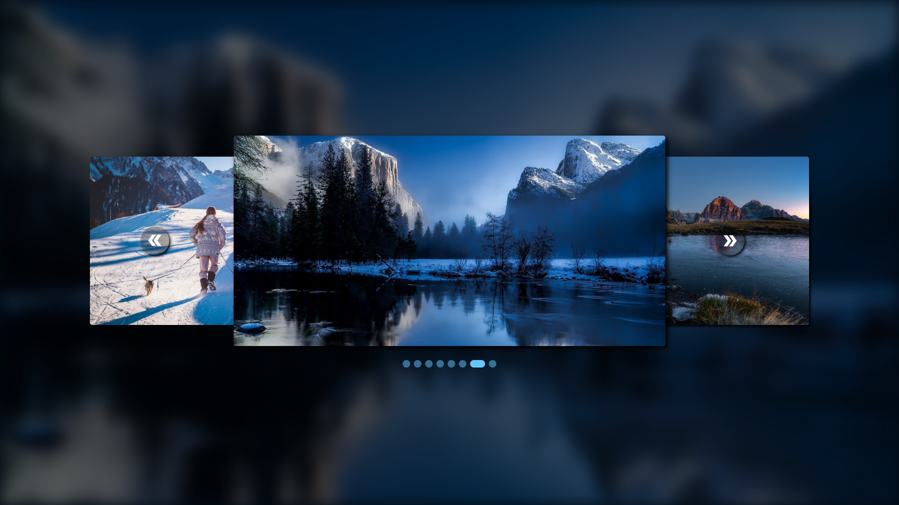

<div>
    
</div>

<div>
    <a href="https://lapis-image-slider.herokuapp.com/slider">Live demo</a>
</div>


<div>
    Run this command to start:
    ```
        npm start
    ```
</div>
<div>
    How to use:
    ```jsx
    <ImageSlider focus={1}>
        <Image src='link of image'>
            your code(option)
        </Image>
        <Image>
            <div>
                your code
            </div>
        </Image>
    </ImageSlider>
    ```
</div>
